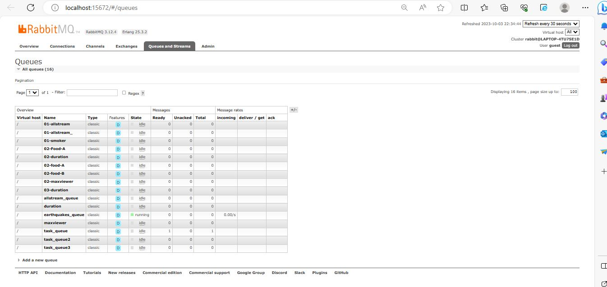
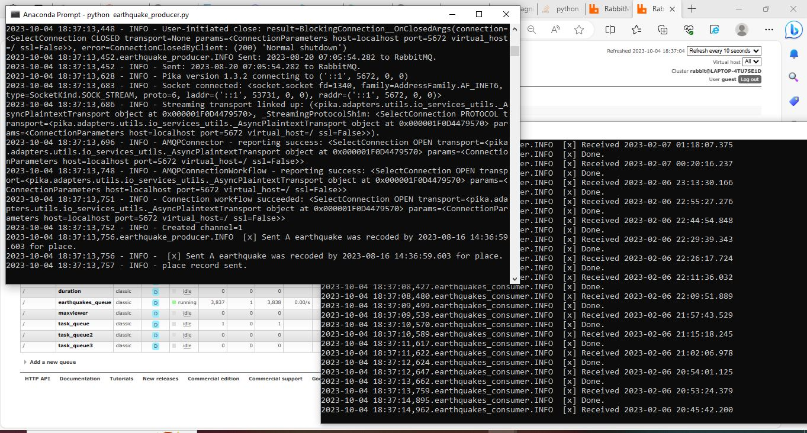

# streaming-07-final-project

This project implements a streaming analytics solution using RabbitMQ for processing earthquakes data. The goal is to realy the updated information in real-time and send alert when the magnitude riser above 4.7 richter scale. with the help of RabbitMQ as the message broker, contionus data is streaming in queue and reads the data from the CSV file at every 10 seconds.

Author: Amaara Aziz
Date: October 4, 2023

## Prerequisites

1. Git
1. Python 3.7+ (3.11+ preferred)
1. VS Code Editor
1. VS Code Extension: Python (by Microsoft)
1. RabbitMQ Server installed and running locally

## Design and Implement Your Producer and Consumer

In GitHub, create a new repo as streaming-06-smart-smoker
Add a README.md 
Clone your repo down to your machine. 
Add a .gitignore.
Add the Smoker-temps csv data file to the repo. 
Create a file for your earthquake producer.
Create 1 consumer

## Task 6. Execute the Producer/Consumer

1. run earthquakes_consumer.py 
2. run earthquakes_consumer.py 
1. Run the file. It will run, emit a message to the named RabbitMQ queue, and finish.
3. Execute commands in the Anaconda Prompt terminal to display the message. 

# Markdown and Visual Studio Code!
!                 

## Resource

- [Kaggle Dataset](https://www.kaggle.com/datasets/ayyuce/turkey-earthquakes)

